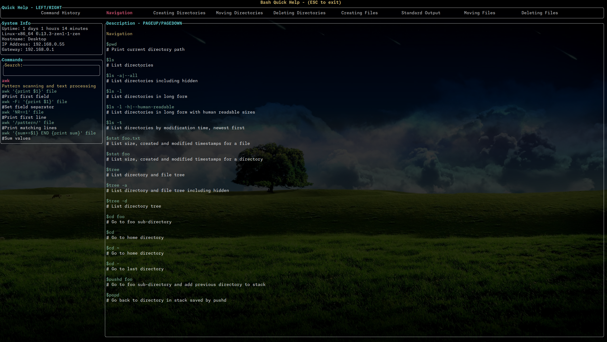

# BashQuickHelp

## A quick utility for referencing bash commands

Initial set of quick help categories were used from https://github.com/RehanSaeed/Bash-Cheat-Sheet

I will add commands and refine help references as things go on. All information is stored in scoped
variables in files:

- include/categories.hpp
- include/commands.hpp

Feel free to make a pull request with any correction or additions.



## Installation Instructions

1. Clone the repository:
   ```bash
   git clone https://github.com/IllicitFrog/BashQuickHelp.git
   ```
2. Navigate to the repository directory:
   ```bash
   cd BashQuickHelp
   ```
3. Run Cmake to resolve dependancies as needed:
   ```bash
   cmake -S . -B build
   ```
4. Install the built packages leaving bashquickhelp binary in your bin folder:
   ```bash
   sudo cmake --build build --target install
   ```
5. Add the following line to your `.bashrc` file to bind the `Ctrl+h` shortcut to the `helpme` function:

   ```bash
   bind -x '"\C-h": bashquickhelp ${READLINE_LINE:0:$READLINE_POINT}'
   ```

   Ensure .bashrc is sourced, by restarting the terminal or with:

   ```bash
   source .bashrc
   ```

## Usage

After completing the installation steps, you can use the `Ctrl+h` shortcut in your terminal to invoke the `bashquickhelp` function. This function will provide quick help based on the current input you have typed.

For example, if you have typed part of a command and press `Ctrl+h`, the `bashquickhelp` function will be triggered to assist you with relevant information or suggestions.

Make sure to customize the `quickbashhelp` function in your `.bashrc` to suit your specific needs.
